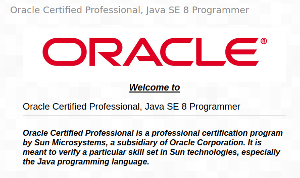

# OCP-java-se8-programmer-1

# Topic 1: Advanced Class Design
## Objectives:
* __Reviewing OCA Concepts__
  * Access modifiers
  * Overloading and Overriding
  * Abstract Classes
  * Static and Final
  * imports
* __Using instanceof__
* __Understanding Virtual Method Invocation__
* __Annotating Overriden Methods__
  * toString
  * .equals
  * hashCode
* __Working with Enums__
  * Using Enums in Switch Statement
  * Adding Constructors, Fields  and Methods
* __Creating Nested Classes__
   * Member Inner Classes
   * Anonymous Inner Classes
* __Use package and import statements__

# Topic 2: Design Patterns and Principles
## Objectives:

* __Designing an Interface__
  * Purpose of an Interface
* __Introducing Functional Programming__
  * Defining a Functional Interface
  * Implementing Functional Interfaces with Lambdas
  * Applying the Predicate Interface
* __Implementing Polymorphism__
  * Distinguishing between an Object and a Reference
  * Casting Object References
* __Understanding Design Principles__
  * Encapsulating Data 
  * Creating JavaBeans 
  * Applying the Is‐a Relationship 
  * Applying the Has‐a Relationship 
  * Composing Objects 
* __Working with Design Patterns__
  * Applying the Singleton Pattern
  * Creating Immutable Objects
  * Using the Builder Pattern
  * Creating Objects with the Factory Pattern

# Topic 3 : Generics and Collections
## Objectives:

* __Reviewing OCA Collections__
  * Array and ArrayList
  * Searching and Sorting
  * Wrapper Classes and Autoboxing
  * The Diamond Operator
* __Working with Generics__
  * Generic Classes
  * Generic Interfaces
  * Generic Methods
  * Interacting with Legacy Code
  * Bounds
  * Putting It All Together
* __Using Lists, Sets, Maps, and Queues__
  * Common Collections Methods
  * Using the List Interface
  * Using the Set Interface
  * Using the Queue Interface
  * Map 138
  * Comparing Collection Types
* __Comparator vs. Comparable__
  * Comparable
  * Comparator
* __Searching and Sorting__
* __Additions in Java 8__
  * Using Method References 
  * Removing Conditionally 
  * Updating All Elements
  * Looping through a Collection
  * Using New Java 8 Map APIs
  
# Topic 4 : Generics and Collections
## Objectives:

* __Using Variables in Lambdas__
* __Working with Built-In Functional Interfaces__
  * Implementing Supplier
  * Implementing Consumer and BiConsumer
  * Implementing Predicate and BiPredicate
  * Implementing Function and BiFunction
  * Implementing UnaryOperator and BinaryOperator
  * Checking Functional Interfaces
* __Returning an Optional__
* __Using Streams__
  * Creating Stream Sources
  * Using Common Terminal Operations
  * Using Common Intermediate Operations
  * Putting Together the Pipeline
  * Printing a Stream
* __Working with Primitives__
  * Creating Primitive Streams
  * Using Optional with Primitive Streams
  * Summarizing Statistics
  * Learning the Functional Interfaces for Primitives
* __Working with Advanced Stream Pipeline Concepts__
  * Linking Streams to the Underlying Data
  * Chaining Optionals
  * Collecting Results
  
# Topic 5: Dates, Strings, and Localization

## Objectives:

* __Working with Dates and Times__
  * Creating Dates and Times
  * Manipulating Dates and Times
  * Working with Periods
  * Working with Durations
  * Accounting for Daylight Savings Time 
* __Reviewing the String class__ 
* __Adding Internationalization and Localization__
  * Picking a Locale
  * Using a Resource Bundle
  * Formatting Numbers
  * Formatting Dates and Times
